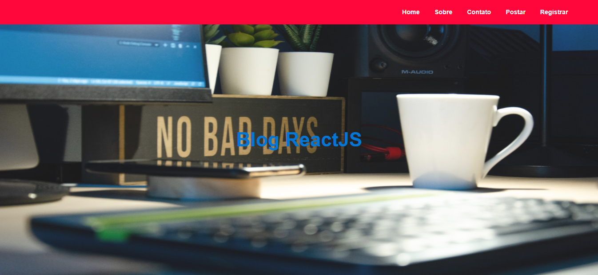

# Blog ReactJS

Fiz esse projeto acompanhando um tutorial no youtube para aprender ReactJS. Para criar as rotas utilizei a biblioteca React Router.

## Referências
Tutorial no youtube sobre construir blog em [ReactJS](https://www.youtube.com/watch?v=tlTdbc5byAs&t=5499s). 
Deploy do React no Heroku, tutorial no [youtube](https://www.youtube.com/watch?v=CrcN_TYLqGM&t=3s).